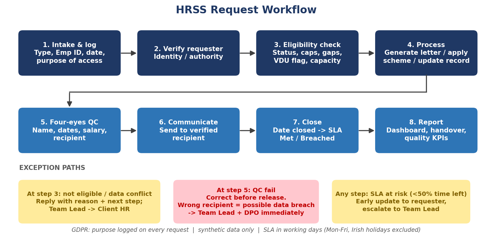
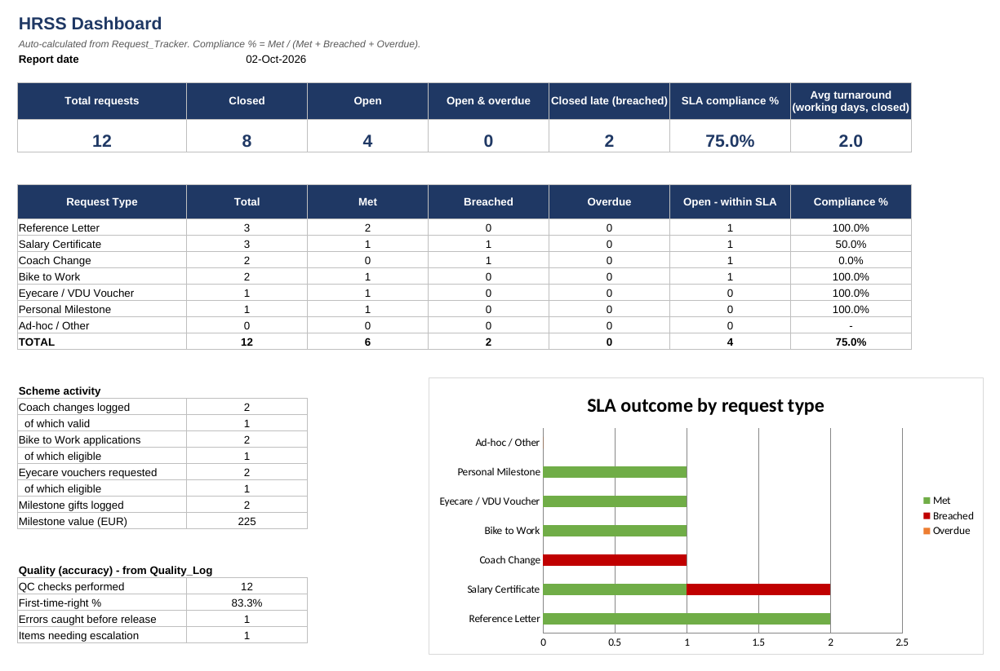
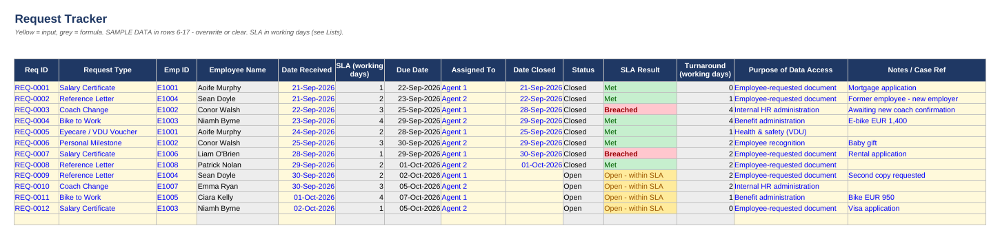
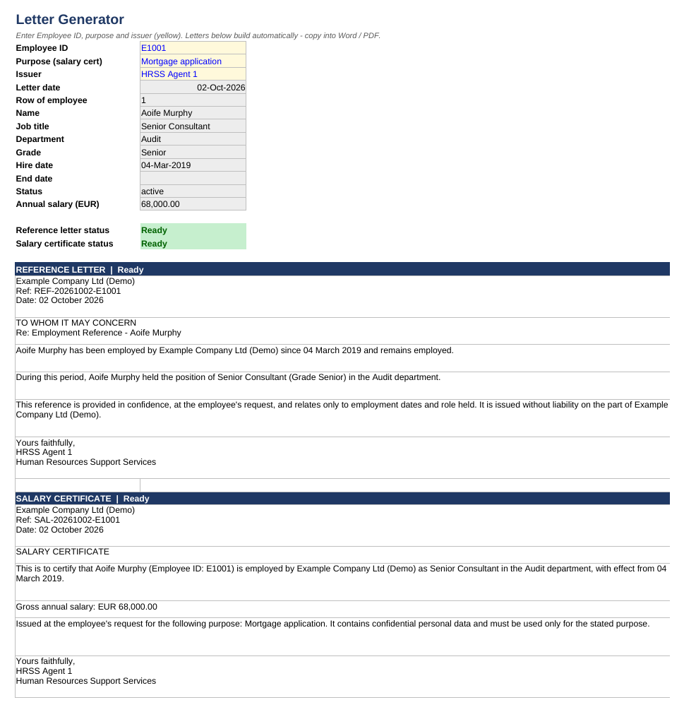
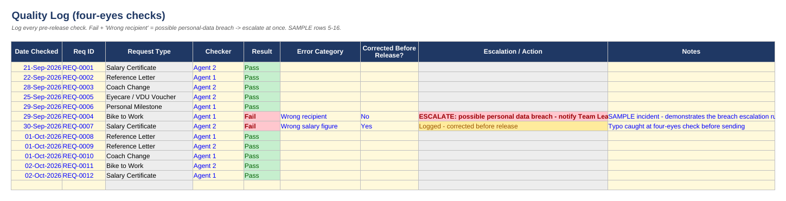

# HRSS Service Desk Operations

An HR Support Services (HRSS) desk simulation: an Excel service tracker, SOPs, GDPR controls and sample outputs covering **reference letters, salary certificates, coach changes, Bike to Work, eyecare/VDU vouchers and personal-milestone gifts** (Perx vouchers, flowers, baby gifts).

> **Honest scope:** a portfolio simulation using **synthetic data only**. It shows process understanding, not employment experience. No live Workday tenant was used - Workday content is conceptual. SLAs, scheme caps/gaps and gift values are illustrative assumptions (editable in the `Lists` sheet), not any employer's policy.



## Repository structure
```
hrss-service-desk-operations/
├── README.md
├── LICENSE
├── 01_Documentation/
│   ├── SOPs.md                    step-by-step procedures for the 6 request types
│   ├── GDPR_Checklist.md          GDPR principles mapped to desk practice
│   ├── Ways_of_Working.md         India-Ireland shift overlap, RACI, escalation, handover, KPIs
│   ├── Communication_Templates.md acknowledgement, completion, decline, delay, incident
│   ├── Workday_Field_Mapping.md   indicative field -> Workday concept mapping
│   └── Closing_The_Gaps.md        what the project can / cannot prove
├── 02_HRSS_Operations/
│   └── HRSS_Service_Desk_Tracker.xlsx   14-sheet workbook (dashboard, tracker, generators, QC, handover)
├── 03_Sample_Outputs/
│   ├── Reference_Letter_Sample.pdf
│   └── Salary_Certificate_Sample.pdf
└── 04_Screenshots/                Dashboard, Request_Tracker, Letter_Generator, Quality_Log, Coach_Validation, Workflow
```
The tracker is deliberately **one workbook**, not seven: the sheets share the employee master and SLA rules through formulas, so splitting them would duplicate data and break lookups.

## What the workbook does
- **SLA tracking in working days** (weekends and Irish public holidays excluded): due date, Met / Breached / Overdue, turnaround.
- **Dashboard**: volumes, compliance % by request type, overdue items, scheme activity, quality KPIs.
- **Letter Generator**: pick an Employee ID to build a reference letter and salary certificate; salary certificates are blocked for non-active staff and need a stated purpose.
- **Rule validation**: coach changes (self-coach, inactive coach, capacity), Bike to Work (cap, repeat-claim gap), eyecare (VDU user, gap period).
- **Quality log**: four-eyes checks, first-time-right %, automatic escalation when a *wrong recipient* error is logged (possible data breach).
- **Handover log**: shift handover with a live count of items due within one working day.
- **Worker history**: effective-dated job history with an as-of lookup (Workday-style concept).
- **GDPR by design**: purpose recorded on every request; salary kept off the tracker; synthetic data.

## Screenshots
| Dashboard | Request tracker |
|---|---|
|  |  |

| Letter generator | Quality log |
|---|---|
|  |  |

Screenshots were rendered with LibreOffice, so fonts may differ slightly from Excel.

## How to use
1. Open `02_HRSS_Operations/HRSS_Service_Desk_Tracker.xlsx` and read the `Guide` sheet (yellow = input, grey = formula).
2. Log a request in `Request_Tracker`, work it using the relevant sheet and SOP, then enter the Date Closed.
3. To regenerate letters, change the Employee ID in `Letter_Generator` (the sample PDFs use E1004 for the reference letter and E1001 for the salary certificate).
4. `Lists!E4` is `=TODAY()`; overwrite it with a fixed date to freeze a report. Sample open requests will become Overdue as time passes.

## Known limitations
- Procedures such as recipient verification, payroll hand-off and email notifications are documented in the SOPs/templates; they are not automated.
- Backlog ageing is defined as a KPI in `Ways_of_Working.md` but is not yet a dashboard table.
- Coach changes do not yet capture an effective date.
- Sample PDFs were generated separately from the workbook text to match its output.

## License
MIT
